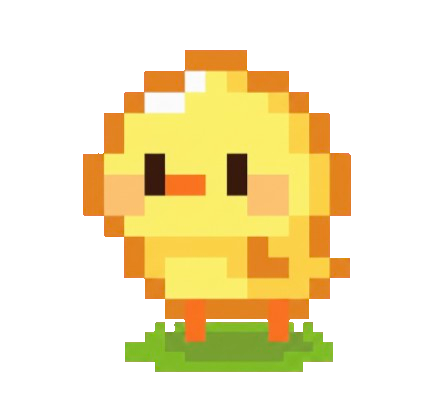
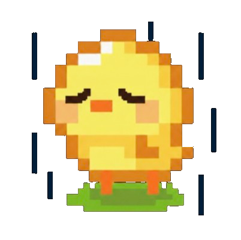

# 🐣 Pomochick

A Pomodoro timer with a pixel art chick — built with Electron.

## Download

Go to the [Releases](https://github.com/haerin99/Pomochick/releases) page to download the latest version:

- **Windows** → `Pomochick.Setup.1.0.0.exe`
- **Mac** → `Pomochick-1.0.0-arm64.dmg`
- **Linux** → `Pomochick-1.0.0.AppImage`

## Features

### 🍅 Pomodoro Timer
- Customizable pomodoro and break lengths
- Sound effects when a pomodoro or break ends

### 🐥 Pixel Art Chick
- 3 states: happy, neutral, and sad <br>
  
- Completing a pomodoro feeds the chick
- Hunger increases daily based on your goals:
  $$\frac{HUNGER/POMO \times POMOS/SESSION \times SESSIONS/DAY}{2}$$
  Complete at least half your planned sessions each day to keep the chick fed
- When hunger reaches 100, the chick dies — use **Pause Hunger** to prevent this, or **Reset Chick** to start over <br>
  

### 📊 Stats
- Days alive, total focus time, and weekly activity

### ⚙️ Settings
- Pomodoro and break lengths
- Hunger per pomo, pomos per session, sessions per day
- Pause hunger (stops the daily increase)
- Reset chick status & stats

## Screenshots


## Development

```bash
npm install
npm start
```

## License

MIT © Hae Rin Kim
